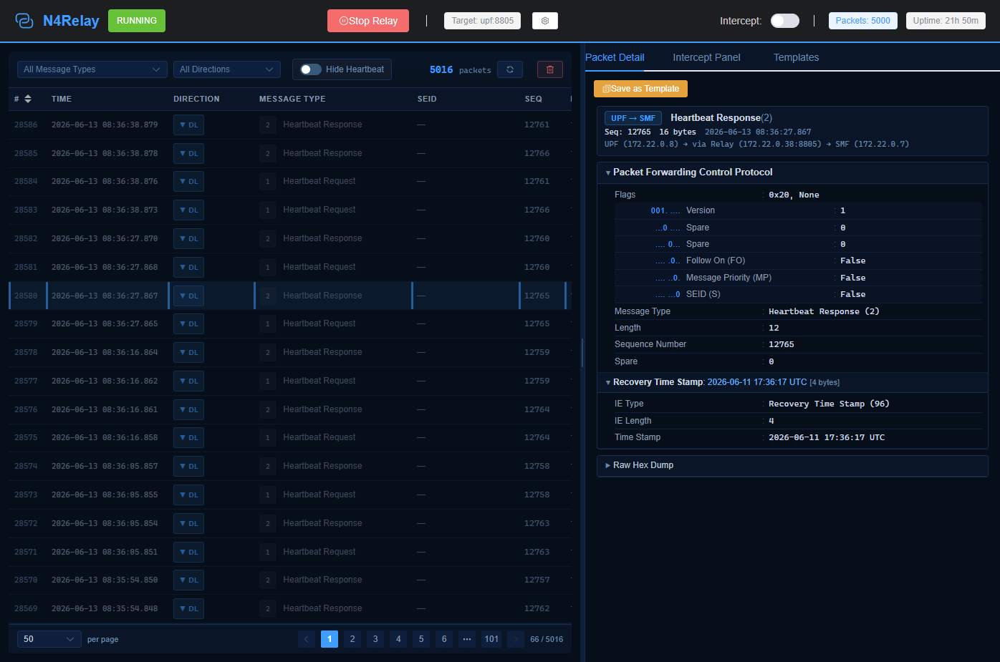

# N4Replay

A PFCP (Packet Forwarding Control Protocol) relay with a Wireshark-style Web UI, designed for debugging, testing, and intercepting the N4 interface between SMF and UPF in a 5G Core Network.

N4Replay sits transparently between SMF and UPF — capturing, parsing, and optionally intercepting PFCP messages in real time — without requiring any changes to the UPF.




## Architecture

```
                     N4Replay
              ┌──────────────────────┐
   PFCP       │  ┌───────────────┐   │       PFCP
  ───────────►│  │  Relay Engine  │───┼──────────►
   (SMF)      │  │  + Parser     │   │           (UPF)
              │  │  + Interceptor│   │
              │  └───────────────┘   │
              │         │            │
              │  ┌──────▼──────┐    │
              │  │  Web UI     │    │
              │  │  (port 8080)│    │
              │  └─────────────┘    │
              └──────────────────────┘
```

**Traffic flow:**


1. SMF sends PFCP messages to N4Replay (thinking it's the UPF)
2. N4Replay parses and stores each message, then forwards to the real UPF
3. UPF responds back through N4Replay to SMF
4. All messages are viewable in the Web UI with full Wireshark-style IE dissection

## Features

* **Transparent PFCP relay** — Zero modification to UPF; SMF only needs a Node ID change
* **Wireshark-style message dissection** — Bit-level breakdown of PFCP header flags, IE fields, and grouped IEs
* **Real-time packet capture** — WebSocket push for live packet updates in the Web UI
* **Packet interception** — Hold, inspect, edit, and release/drop PFCP messages on the fly
* **IE editing** — Modify IE values (IP addresses, TEIDs, rule IDs, interfaces, etc.) before releasing
* **Node ID rewriting** — Automatically rewrites UPF's Node ID in responses to match SMF expectations
* **Template-based auto-responder** — Match and replay PFCP sessions automatically using saved templates
* **REST API** — Full programmatic control over relay, interception, and packet inspection
* **Drag-to-resize panels** — Adjustable packet list and detail panels in the Web UI
* **Dark theme UI** — Modern dark interface with pagination and message type filtering

## Project Structure

```
n4replay/
├── backend/                    # Python (FastAPI + asyncio)
│   ├── app/
│   │   ├── main.py             # Application entry point
│   │   ├── config.py           # YAML config loader
│   │   ├── models.py           # Pydantic request/response models
│   │   ├── api/
│   │   │   ├── routes.py       # REST API endpoints
│   │   │   └── websocket.py    # WebSocket handlers
│   │   ├── pfcp/
│   │   │   ├── constants.py    # 3GPP TS 29.244 constants (IE types, message types)
│   │   │   ├── parser.py       # PFCP message parser (header + IEs)
│   │   │   ├── ies.py          # IE-specific parsers (Node ID, F-SEID, F-TEID, etc.)
│   │   │   └── builder.py      # PFCP message builder (for modified packets)
│   │   └── relay/
│   │       ├── server.py       # UDP relay server
│   │       └── interceptor.py  # Packet interception logic
│   └── requirements.txt
├── frontend/                   # Vue 3 + TypeScript + Element Plus
│   └── src/
│       ├── App.vue             # Main layout with resizable panels
│       ├── components/
│       │   ├── PacketList.vue      # Packet list table with pagination
│       │   ├── PacketDetail.vue    # Wireshark-style protocol tree
│       │   ├── IEViewer.vue        # Recursive IE tree viewer
│       │   ├── FieldRow.vue        # Bit pattern / field row renderer
│       │   ├── IEEditor.vue        # IE field editor (for intercepted packets)
│       │   ├── FieldEditor.vue     # Intercept edit dialog
│       │   ├── InterceptPanel.vue  # Intercepted packet management
│       │   └── TemplateManager.vue # Template editor and auto-responder
│       ├── api/                # REST client + WebSocket handlers
│       └── types/index.ts      # TypeScript type definitions
├── flood/                      # PFCP flood testing tools
│   └── pfcp_flood.py           # Generic hex-driven PFCP flood script
├── config/
│   └── n4replay.yaml           # Default N4Replay configuration
├── 5gc/
│   ├── free5gc/                # Free5GC deployment with N4Replay
│   │   ├── docker-compose.yaml
│   │   └── config/
│   └── open5gs/                # Open5GS deployment with N4Replay
│       ├── docker-compose.yaml
│       └── config/
└── Dockerfile                  # Multi-stage build (frontend + backend)
```


## Integration with Open5GS

To deploy N4Replay between SMF and UPF in Open5GS, modify **three configuration files** and add the N4Replay service to `docker-compose.yaml`.

### 1. Modify SMF Configuration (`config/smf/smf.yaml`)

In the `pfcp.client.upf` section, change the UPF address to point to N4Replay:

```yaml
smf:
    pfcp:
      server:
        - address: SMF_IP
      client:
        upf:
          - address: N4RELAY_IP    # ← Point to N4Replay instead of UPF
```

> **Without N4Replay**, the original config would be:
>
> ```yaml
> client:
>   upf:
>     - address: UPF_IP
> ```

### 2. Modify UPF Configuration (`config/upf/upf.yaml`)

In the `pfcp.client.smf` section, change the SMF address to point to N4Replay:

```yaml
upf:
    pfcp:
      server:
        - address: UPF_IP
      client:
        smf:
          - address: N4RELAY_IP    # ← Point to N4Replay instead of SMF
```

> **Without N4Replay**, the original config would be:
>
> ```yaml
> client:
>   smf:
>     - address: SMF_IP
> ```

### 3. Configure N4Replay (`config/n4replay.yaml`)

```yaml
relay:
  listen_addr: "0.0.0.0"
  listen_port: 8805
  # The real UPF to forward PFCP traffic to
  target_addr: "upf"
  target_port: 8805
  # Rewrite UPF's Node ID to relay's own IP (auto mode)
  smf_upf_node_id: "auto"

web:
  host: "0.0.0.0"
  port: 8080

intercept:
  enabled: false
  max_held: 100
```

### 4. Add N4Replay to `docker-compose.yaml`

```yaml
  n4replay:
    build:
      context: ../../
      dockerfile: Dockerfile
    container_name: n4replay
    volumes:
      - ../../config/n4replay.yaml:/app/config/n4replay.yaml
      - ../../backend:/app/backend
      - ../../frontend:/app/frontend
    expose:
      - "8805/udp"
      - "8080/tcp"
    ports:
      - "8001:8080/tcp"        # Web UI exposed on port 8001
    depends_on:
      - upf
    networks:
      default:
        ipv4_address: ${N4RELAY_IP}
```

Add `N4RELAY_IP` to your `.env` file:

```bash
N4RELAY_IP=172.22.0.38
```

### Summary of Changes

| File | What to Change |
|----|----|
| `config/smf/smf.yaml` | `pfcp.client.upf.address` → `N4RELAY_IP` |
| `config/upf/upf.yaml` | `pfcp.client.smf.address` → `N4RELAY_IP` |
| `config/n4replay.yaml` | `target_addr` → real UPF hostname/IP |
| `docker-compose.yaml` | Add `n4replay` service with `depends_on: upf` |


## Integration with Free5GC

To deploy N4Replay between SMF and UPF in Free5GC, modify **two configuration files** and add the N4Replay service to `docker-compose.yaml`.

### 1. Modify SMF Configuration (`config/smfcfg.yaml`)

In `userplaneInformation.upNodes.UPF`, change the `nodeID` to point to N4Replay's hostname:

```yaml
configuration:
  userplaneInformation:
    upNodes:
      UPF:
        type: UPF
        # Change nodeID to N4Replay's hostname
        nodeID: n4relay.free5gc.org
        # Keep addr as the real UPF address (N4Replay uses this for forwarding)
        addr: upf.free5gc.org
```

> **Without N4Replay**, the original config would be:
>
> ```yaml
> UPF:
>   type: UPF
>   nodeID: upf.free5gc.org
>   addr: upf.free5gc.org
> ```

### 2. Configure N4Replay (`config/n4replay.yaml`)

```yaml
relay:
  listen_addr: "0.0.0.0"
  listen_port: 8805
  target_addr: "upf.free5gc.org"
  target_port: 8805
  # Must match the nodeID in SMF's userplaneInformation.upNodes.UPF.nodeID
  smf_upf_node_id: "n4relay.free5gc.org"

web:
  host: "0.0.0.0"
  port: 8080

intercept:
  enabled: false
  max_held: 100
```

### 3. Add N4Replay to `docker-compose.yaml`

```yaml
  n4relay:
    container_name: n4relay
    build:
      context: ../..
      dockerfile: Dockerfile
    ports:
      - "8001:8080"             # Web UI exposed on port 8001
    volumes:
      - ./config/n4replay.yaml:/app/config/n4replay.yaml
      - ../../backend:/app/backend
      - ../../frontend:/app/frontend
    networks:
      privnet:
        ipv4_address: 10.100.200.50
        aliases:
          - n4relay.free5gc.org
    depends_on:
      - free5gc-upf
```

Ensure SMF depends on N4Replay:

```yaml
  free5gc-smf:
    depends_on:
      - free5gc-nrf
      - free5gc-upf
      - n4relay              # Add this dependency
```

### Summary of Changes

| File | What to Change |
|----|----|
| `config/smfcfg.yaml` | `UPF.nodeID` → `n4relay.free5gc.org` |
| `config/n4replay.yaml` | `target_addr` → real UPF hostname, `smf_upf_node_id` → matches SMF's UPF nodeID |
| `docker-compose.yaml` | Add `n4relay` service; add it to SMF's `depends_on` |

**No changes to UPF configuration are required.**


## Building & Running

### Docker Build

```bash
# From the N4Replay project root
docker build -t n4replay .
```

### Run with Open5GS

```bash
cd 5gc/open5gs
docker compose up -d
```

### Run with Free5GC

```bash
cd 5gc/free5gc
docker compose up -d
```

### Development Mode (Hot Reload)

Mount backend source code as volumes for live code changes:

```yaml
# In docker-compose.yaml, under n4replay service:
volumes:
  - ./config/n4replay.yaml:/app/config/n4replay.yaml
  - ../../backend:/app/backend       # Live backend code
  - ../../frontend:/app/frontend     # Frontend source (rebuild separately)
```

Rebuild frontend after changes:

```bash
cd frontend
npm run build
# Changes are picked up via volume mount automatically
```

## Web UI

Open `http://<host>:8001` in a browser.

### Features

* **Packet List** — All captured PFCP messages with direction, type, SEID, and sequence number; supports filtering by message type and direction, heartbeat hiding, and pagination (20/50/200 per page)
* **Packet Detail** — Wireshark-style protocol tree with:
  * Bit-level flag breakdown (e.g., `001. .... = Version: 1`)
  * IE Type and IE Length shown for each IE
  * Grouped IE hierarchy (e.g., Create PDR → PDI → F-TEID, UE IP Address, SDF Filter)
  * Summary text on IE title lines (e.g., `Node ID : FQDN: smf.free5gc.org`)
* **Intercept Panel** — Hold and manage intercepted packets; bulk release/drop
* **Templates** — Save packets as templates for auto-response matching
* **Edit Dialog** — Modify IE values before releasing intercepted packets
* **Resizable Panels** — Drag the divider between packet list and detail panel

## REST API

Base URL: `http://<host>:8001/api/v1`

### Status

| Method | Endpoint | Description |
|----|----|----|
| GET | `/status` | Get relay status, packet counts, queue stats |
| PUT | `/status` | Start/stop relay, toggle intercept, change target |

**PUT** `/status` body:

```json
{
  "running": true,
  "intercept_enabled": true,
  "target_addr": "upf",
  "target_port": 8805
}
```

### Packets

| Method | Endpoint | Description |
|----|----|----|
| GET | `/packets` | List captured packets (supports `offset`, `limit`, `msg_type`, `direction`, `exclude_heartbeat` query params) |
| GET | `/packets/{id}` | Get full packet detail with parsed header, IEs, and raw hex |
| DELETE | `/packets` | Clear all captured packets |

### Intercepted Packets

| Method | Endpoint | Description |
|----|----|----|
| GET | `/intercepted` | List all held (intercepted) packets |
| GET | `/intercepted/{id}` | Get full detail of an intercepted packet |
| PUT | `/intercepted/{id}` | Modify an intercepted packet's fields |
| POST | `/intercepted/{id}/release` | Release (forward) the packet to UPF |
| POST | `/intercepted/{id}/drop` | Drop the packet (do not forward) |

**PUT** `/intercepted/{id}` body:

```json
{
  "modifications": {
    "ies.0.value.ipv4_address": "10.0.0.99",
    "ies.1.value.teid": 12345
  }
}
```

## Configuration Reference

| Key | Type | Default | Description |
|----|----|----|----|
| `relay.listen_addr` | string | `0.0.0.0` | UDP listen address for PFCP |
| `relay.listen_port` | int | `8805` | UDP listen port |
| `relay.target_addr` | string | — | UPF hostname or IP to forward to |
| `relay.target_port` | int | `8805` | UPF PFCP port |
| `relay.smf_upf_node_id` | string | — | Node ID to rewrite in UPF responses (`"auto"` uses relay's own IP) |
| `web.host` | string | `0.0.0.0` | Web UI / API bind address |
| `web.port` | int | `8080` | Web UI / API port (inside container) |
| `intercept.enabled` | bool | `false` | Start with interception enabled |
| `intercept.max_held` | int | `100` | Max packets held simultaneously |
| `buffer.max_packets` | int | `5000` | Max packets stored in history |
| `queue.max_size` | int | `10000` | Max packets in processing queue |
| `queue.workers` | int | `4` | Number of async worker tasks |

## Supported PFCP Messages

N4Replay parses the following PFCP message types per 3GPP TS 29.244:

* Session Establishment Request / Response (50/51)
* Session Modification Request / Response (52/53)
* Session Deletion Request / Response (54/55)
* Session Report Request / Response (56/57)
* Heartbeat Request / Response (1/2)
* Association Setup / Update / Release (5–10)

## Supported IE Parsers

Deep dissection with bit-level breakdown for:

Node ID, F-SEID, F-TEID, UE IP Address, SDF Filter, Network Instance, Source/Destination Interface, Outer Header Creation/Removal, Apply Action, Gate Status, MBR, GBR, Cause, Precedence, PDR ID, FAR ID, QER ID, URR ID, Usage Report Trigger, Start Time, End Time, Volume Measurement, Recovery Time Stamp, Report Type, Reporting Triggers, Measurement Method, and all grouped IEs (Create PDR, PDI, Create FAR, Create URR, Create QER, Usage Report, etc.).

## Tech Stack

* **Backend:** Python 3, FastAPI, asyncio, uvicorn, PyYAML
* **Frontend:** Vue 3, TypeScript, Vite, Element Plus
* **Protocol:** PFCP (3GPP TS 29.244), UDP port 8805


